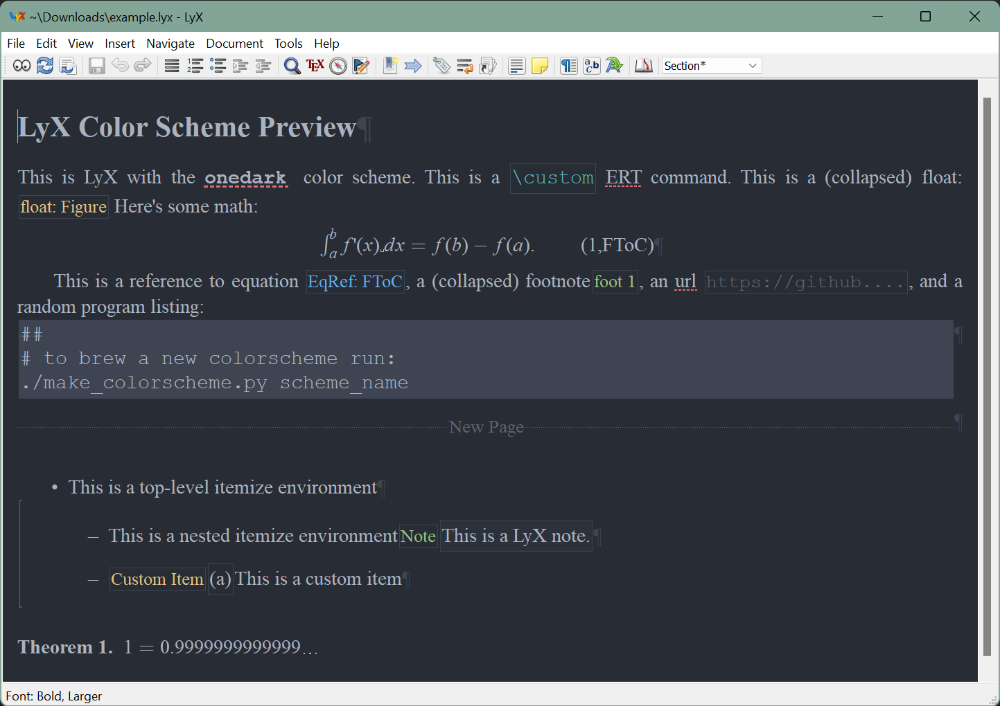
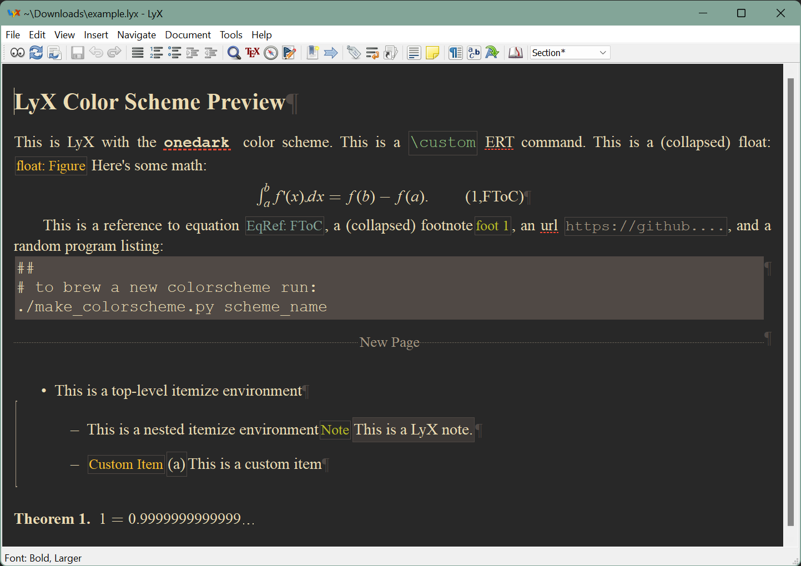

# lyx-colorscheme-brewer

A colorscheme brewer for LyX. It takes 16 color palettes and turns them into
LyX colorschemes.

## Ready-to-use color schemes

The following schemes have been created with `lyx-colorscheme-brewer` and are ready to
be used. Check out the linked repositories for install instructions.
* [onedark](https://github.com/urob/onedark.lyx)
* [gruvbox](https://github.com/urob/gruvbox.lyx)

<a href="screenshots/onedark.png"></a>
<a href="screenshots/gruvbox.png"></a>

## Creating new color schemes

1. Create a color palette and save it as `colors/theme_name.def`. Color palettes are
   Python dictionaries mapping 16 + 3 color keys to HTML color codes. The following
   example provides a template: 
    ```py
    palette = {
        # special
        "foreground":    "#ebdbb2",
        "background":    "#282828",
        "cursorcolor":   "#ebdbb2",

        # black
        "black":         "#3c3836",
        "brightblack":   "#504945",

        # red
        "red":           "#fb4934",
        "brightred":     "#cc241d",

        # green
        "green":         "#b8bb26",
        "brightgreen":   "#98971a",

        # yellow
        "yellow":        "#fabd2f",
        "brightyellow":  "#d79921",

        # blue
        "blue":          "#83a598",
        "brightblue":    "#458588",

        # magenta
        "magenta":       "#d1849b",
        "brightmagenta": "#b16286",

        # cyan
        "cyan":          "#8ec07c",
        "brightcyan":    "#689d6a",

        # gray/white
        "gray":          "#a89984",
        "white":         "#ebdbb2",
    }
    ```
2. Use the `make_colorscheme.py` script to create the LyX color scheme. For example, to
   create the Gruvbox color scheme from the color palette defined in
   `colors/gruvbox.def` file, run:
    ```
    make_colorscheme.py gruvbox
    ```
    This creates a LyX colorscheme and saves it to `out/gruvbox_lyx_cs`.
